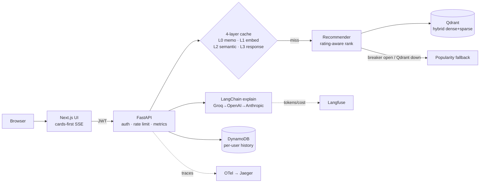

# Conversational, Rating-aware Product Recommender — Case Study

> A demo Flipkart review-chatbot (Flask + LangChain + AstraDB) transformed into a
> production-architected, conversational **product recommender** with grounded explanations,
> evaluation gates, observability, security, and full IaC/CI-CD.

## TL;DR

Built an end-to-end GenAI recommender: **hybrid retrieval (Qdrant dense+sparse) → rating-aware
ranking → grounded LLM explanations** with a multi-provider fallback chain, served by an
async FastAPI API (SSE streaming) behind JWT auth + rate limiting, with a 4-layer cache, DynamoDB
per-user history, OpenTelemetry + Langfuse observability, circuit-breaker degradation, a Next.js
streaming UI, Docker/Helm/Terraform, and GitHub Actions CI with **eval gates that block on quality
regression**. 83 automated tests; dependency/code/license audits clean. Scope is honest: it's a
*within-category* (audio) recommender on a small real dataset, built to production spec and verified
at small scale — live multi-region operation is the documented next stage.

## The problem

The starting point was a portfolio demo: a Flask review-QA chatbot doing naive dense RAG over
product reviews. Representative issues: **all users shared one in-memory conversation** (cross-user
leakage, lost on restart), the Flask **dev server in the "production" path**, a Prometheus counter
that measured page loads instead of inferences, no tests, no eval, no auth, no IaC, and the
`rating`/`summary` signal in the data was thrown away.

## What I built

Reframed it as a **content-based, rating-aware recommender** (using the discarded rating signal) with
conversational, grounded explanations:

- **Retrieval:** Qdrant **hybrid** (dense `text-embedding-3-small` + sparse BM25), payload-filtered.
- **Ranking (the recommender):** `final = 0.7·relevance + 0.3·rating_norm·volume_confidence` — a
  5★-from-2-reviews can't beat a 4.5★-from-500; a "no good match" floor.
- **Explanations:** LangChain chain; the LLM writes only *grounded reasons* (product set is fixed by
  ranking, so injected review text can't add/swap products), with a **Groq→OpenAI→Anthropic**
  fallback chain.
- **API:** FastAPI — `/recommend` (fast, ranking-only), `/chat` (SSE: cards stream first, then the
  explanation token-by-token), `/health`, `/metrics`, plus RTBF (`DELETE /account`) + DSAR export.

## Architecture

| Layer | Choice | Why (trade-off) |
|---|---|---|
| Vector DB | Qdrant hybrid | scales to 100M+, native hybrid + payload; a stateful service to run |
| Primary DB | DynamoDB single-table | KV scale, one-partition RTBF; access patterns lock early |
| Orchestration | LangChain (LCEL) | first-party integrations + ecosystem; churn risk, pinned |
| LLM | Groq primary, OpenAI/Anthropic fallback | cost/speed leader + no single-provider outage |
| Compute/IaC | EKS + Terraform + Helm | resume-relevant, GPU-ready; highest ops surface |
| Auth | Clerk (JWT) | fast integration; vendor cost at scale |

## Results (real, measured here)

| Signal | Value | Note |
|---|---|---|
| Ranking eval | **NDCG@3 0.80 · MRR 0.83 · Recall@3 0.82** | golden set, real pipeline |
| Answer quality | **relevancy 0.94 · faithfulness 0.56 · context-precision 0.65** | LLM-judge; faithfulness is the honest weak spot |
| Reranker A/B | improved MRR but **regressed NDCG@3** → **gated OFF** | measured, not assumed |
| Tests | **83** (unit + real-service integration), ruff + mypy-strict clean | eval gates block CI on regression |
| Security | pip-audit: **0 vulns** · bandit: **0 issues** · licenses permissive | run in CI |
| Caching | L3 response hit on repeat query; semantic cache (Qdrant) round-trips | the cost lever |
| Resilience | circuit-breaker → popularity fallback; Redis/LLM-down degradation | 6 chaos tests |

**Scale & cost — design targets, not yet measured:** the system is *architected* for 1M MAU /
~200 RPS / p95 < 2s / < $0.005/query (caching + model tiering + autoscaling). A k6 load script is
written (`ops/load/k6-recommend.js`) but the real load/cost numbers come from the Phase-6 deploy on
EKS — **I have not measured them yet and won't quote figures I haven't run.**

## Honest limitations

- **Dataset:** 9 audio products / 450 reviews → this is genuinely a *within-category* recommender;
  metrics reflect that (Recall@k is near-trivial at this catalog size).
- **Faithfulness 0.56** — explanations sometimes assert beyond the cited reviews; fixable with
  stricter prompting / wider context (the eval gate exists to prove any improvement).
- **RAGAS** library was unusable in this stack (unresolvable `langchain_community` dep conflict) →
  equivalent custom LLM-judge harness.
- **Helm/Terraform** are syntax-validated, not yet `apply`-ed; **Clerk/GrowthBook/ARQ-worker** are
  wired-for but partly stubbed; the API image is ~725MB (sparse-embedding dep on the serving path).
- **Capability honesty:** this demonstrates strong *build & configuration* capability and is verified
  at small scale; it does **not** claim *operation* at millions-of-users scale — that requires real
  traffic and on-call, which is the next stage (a job/launched product), not a portfolio artifact.

## What I'd do differently next time

1. Start from a larger, multi-category dataset so the recommender story isn't dataset-limited.
2. Invest in faithfulness earlier (citation enforcement, tighter context) before building scaffolding.
3. Extract a sparse-embedding microservice so the API image slims dramatically.
4. Stand up the cloud (Phase 6) first on a tiny footprint to get *real* latency/cost numbers into the
   story sooner.

## Tech stack

Python 3.12 · FastAPI · LangChain · Qdrant · OpenAI/Groq/Anthropic · DynamoDB · Redis · Clerk (JWT) ·
OpenTelemetry · Jaeger · Langfuse · Next.js/TypeScript · Docker · Helm · Terraform (EKS/VPC/
ElastiCache/S3/ECR) · GitHub Actions · uv/ruff/mypy/pytest · pip-audit/bandit/Trivy.

## Run / verify it

See [docs/how-to-verify.md](how-to-verify.md) — one-command regression sweep, per-step checks, and
the local equivalent of the CI pipeline. Decisions: [docs/decision-log.md](decision-log.md);
hardening status: [docs/hardening.md](hardening.md); runbook: [docs/runbook.md](runbook.md).
