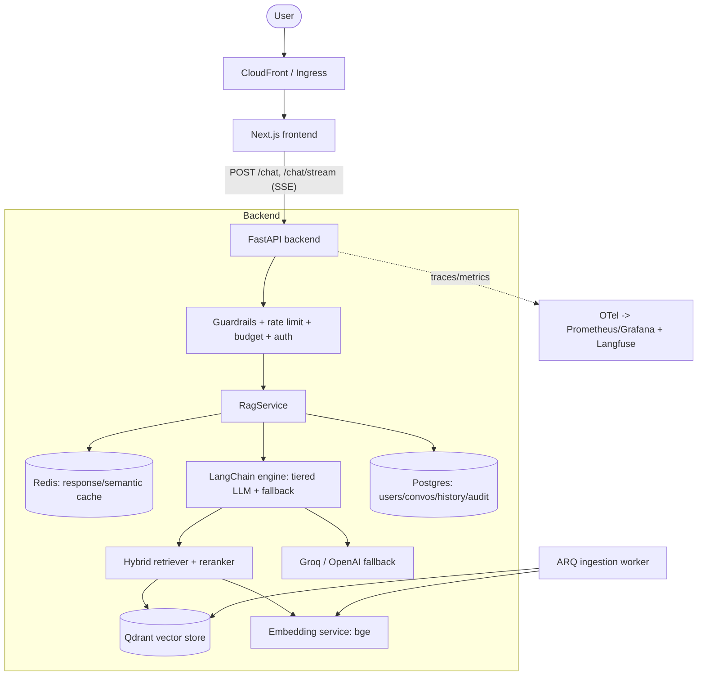

# Architecture

Production-grade RAG product recommender. Decisions are recorded in
[`05-phase2-decision-log.md`](05-phase2-decision-log.md); this is the as-built overview.

## Component diagram



## Request flow (chat)
1. Frontend POSTs to `/chat/stream` with a Bearer token.
2. Backend: auth (JWT) → rate limit → budget guard → input guardrail.
3. Session is namespaced per-user (history isolation); first-turn standalone questions are
   cache-eligible.
4. `RagService` checks the cache (exact, then semantic); on miss it calls the engine.
5. Engine selects a model tier (cheap default, escalate on complex queries; kill-switch
   forces cheap) and runs hybrid retrieval (dense+BM25) + reranking against Qdrant, using the
   self-hosted embedding service.
6. Tokens stream back over SSE with citations; usage is metered to Prometheus + the user's
   daily token budget.

## Layers → decisions
| Layer | Tech | Decision |
|---|---|---|
| Frontend | Next.js + SSE | D8 |
| Backend | FastAPI async | D7 |
| Vector store | Qdrant (hybrid + rerank) | D2, D3, D6 |
| Embeddings | self-hosted bge | D5, D12 |
| LLM | Groq tiered + OpenAI fallback | D4 |
| DB | Postgres (async SQLAlchemy) | D1 |
| Cache | Redis (response + semantic) | D10 |
| Auth | Cognito / JWT (swappable) | D9 |
| Resilience | retry/breaker/degrade | D21 |
| Observability | OTel + Prometheus + Langfuse | D13, D17 |
| Infra | Docker, EKS+Helm, Terraform | D14, D15 |
| CI/CD | GitHub Actions + RAGAS gate | D16, D19 |
| Cost/limits | rate limit, budget, kill-switch | D20 |
| Security | injection neutralize, PII scrub | D18 |
```
